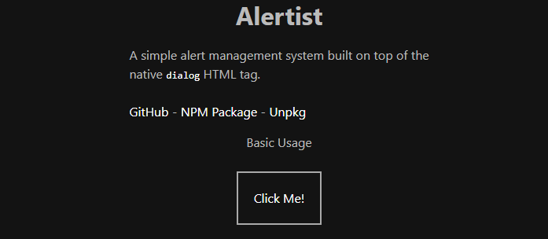

# Alertist

A simple alert management system built on top of the native [**"dialog"**](https://developer.mozilla.org/en-US/docs/Web/HTML/Element/dialog) HTML tag.



Simply install the package:

```
npm install alertist
```

and then import it in your project.

```javascript
import alertist from 'alertist';
```

Don't forget to import either the SASS file for styling inside the
`src/scss/main.scss` or include the `dist/alertist.css` file in your
document.

If you intend not to use this in a framework and instead just want to test
it out in a browser, you can use `unpkg` and include the js and css files into
your document.

```html
<link href="https://unpkg.com/alertist/dist/alertist.css" rel="stylesheet">
<script src="https://unpkg.com/alertist/dist/alertist.browser.js"></script>
```

That's it!

---

## Features

- Supports dragging of the alert window
- Plenty of customizability
- Function checker before calling okCallback (WIP)
- Pop out a form into the alert window (WIP)

---

## Customization

You can customize the dialog styling by overwriting the SASS variables inside the
`src/scss/variables.scss`. If you want more customizability, you can always style it
yourself, up to you!

---

We currently have 2 types of alerts available. This will expand in the future but
as of now this is what the package offers.

1. Alert
2. Confirm

## Alert

Syntax:
```javascript
// Use it like this:
alertist.alert({
	title: 'Title',
	text: 'Hello world!',
	button: 'Yes', // default: 'OK'
	okCallback: () => {},
	cancelCallback: () => {},
	check: () => { return true }, // You can omit this
});
```

Here's the HTML if you want to style this alert type yourself:
```html
<dialog class="alertist alertist-alert" style="transform: translate(0px, 0px)">
	<div class="alertist-container">
		<div class="alertist-header">
			<div class="alertist-title" draggable="true"></div>
			<button class="alertist-title_close"></button>
		</div>
		<div class="alertist-body"></div>
		<div class="alertist-footer">
			<button class="alertist-footer_button"></button>
		</div>
	</div>
</dialog>
```

## Confirm

Syntax:
```javascript
// Use it like this:
alertist.confirm({
	title: 'Title',
	text: 'Hello world!',
	button: 'Yes', // default: 'OK'
	cancel: 'No', // default: 'Cancel'
	okCallback: () => {},
	cancelCallback: () => {},
	check: () => { return true }, // You can omit this
});
```

Here's the HTML if you want to style this alert type yourself:
```html
<dialog class="alertist alertist-confirm" style="transform: translate(0px, 0px)">
	<div class="alertist-container">
		<div class="alertist-header">
			<div class="alertist-title" draggable="true"></div>
			<button class="alertist-title_close"></button>
		</div>
		<div class="alertist-body"></div>
		<div class="alertist-footer">
			<button class="alertist-footer_button"></button>
			<button class="alertist-footer_cancelbutton"></button>
		</div>
	</div>
</dialog>
```

## `callback` Functions

There are three functions that you can add to the alertist object parameter.

### `okCallback`

Pretty self explanatory. This function will run when the user clicks on the "OK" button.

### `cancelCallback`

This function will run when either the X button, the Cancel button, or the background backdrop
gets clicked.

### `check`

*Usage:*
```javascript
alertist.confirm({
	text: 'Hello world!',
	check: (dialogElement) => { return true },
});

alertist.confirm({
	text: 'Hello world!',
	check: (dialogElement) => { return false },
});

alertist.confirm({
	text: 'Hello world!',
	check: (dialogElement) => {
		return new Promise((resolve, reject) => {
			resolve();
		});
	},
});

alertist.confirm({
	text: 'Hello world!',
	check: (dialogElement) => {
		return new Promise((resolve, reject) => {
			reject();
		});
	},
});

alertist.confirm({
	text: 'Hello world!',
	check: async (dialogElement) => {
		const value = await fetch(`https://example.com/api`)
		return value === 'ok' ? true : false;
	},
});
```

This is a function that will run when the user attempts to click on the "OK" button. If unassigned,
this defaults to a function that returns `true`, but you can override this so that you can try doing
some kind of check before the `okCallback` function runs. It needs a return statement if assigned, and 
will accept either a `return true`, `return false`, a promise that `resolve()` or a promise that
`reject()`. If the function receives a `false` or a `reject()`, the alert box will remain open and will
not close.
